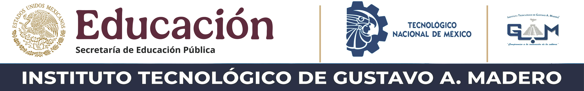

# Desarrollo web SSR - 2026A

Repositorio de la materia de desarrollo web SSR (Server Side Rendering)

## Contenido

- Ramas del proyecto
- Proyecto eje de la materia 

## Objetivo

Documentar los sprints del proyecto que se desarrollaran a lo largo del curso.

## Ramas del proyecto

 - `dev`: Rama de desarrollo!
 - `main`: Rama principal

 ## Convenciones de commits 

 |Codigo|Descripción|
 |----|----|
 |feat:✨| Nueva funcionalidad|
 |fix: 🐛| Corrección de errores|
 |Docs: 📄| Cambios en la documentación|
 |Style: 🎨| Cambio de aspecto visual|
 |refactor: ♻️ | Refactorización de codigo|
 |perf: ⚡ | Mejoras de rendimiento|
 |test: 👍 | Cambios en los test|
 |chore: 🔧 | Cambios en dependencias|
 |ci: 🤖 | Cambios en el CI/CD|
 |revert: ⏪ | Reversión de commits|

 **Ejemplo**: 
 >feat ✨: Agrega automatización de usuarios

 # 📚 stack

 ## BACK-END
 - [Node](./.github/doc/node.md)

 # 👨‍🦰 Autor 

 [Irán Ledezma](https://github.com/iranledezma2414)

 